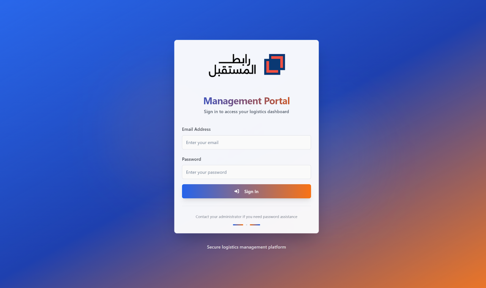
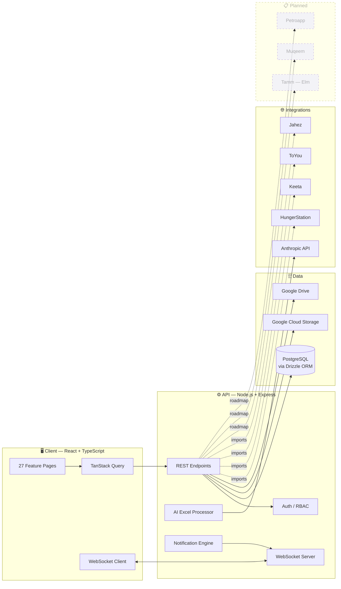

<!-- ─────────────  HEADER  ───────────── -->

<div align="center">


<br/>

<p>
  <strong>The single system of record for a multi-city last-mile food-delivery 3PL in Saudi Arabia.</strong><br/>
  Workforce · Fleet · Payroll · Compliance · Finance — unified across six cities.
</p>

<p>
  
  
  
</p>

<p>
  
  
  
  
  
  
  
  
</p>

<br/>



<sub><i>Live dashboard — city-scoped filtering, fleet status, per-platform performance, and unit economics.</i></sub>

</div>

<br/>

---

## ✦ &nbsp; Why 3PLink exists

Last-mile food-delivery 3PLs in Saudi Arabia operate a brutal operational stack:

- **4+ disconnected platform dashboards** — HungerStation (Looker Studio), Keeta, ToYou (Odoo), Jahez — each with its own payroll format, earnings structure, and deduction logic.
- **2+ government systems** — Tamm (vehicle delegations), Muqeem (residency verification) — with time-sensitive legal consequences if ignored.
- **Dozens of manual Excel workflows** — payroll reconciliation, Iqama tracking, fuel receipts, accommodation costs, courier-to-vehicle assignments — owned by whoever happens to be in the office that week.

**3PLink collapses all of this into one operational system of record.** Every courier, every vehicle, every riyal, every document — visible in one place, drillable down to the courier level, filterable by city.

Built in production at [Future Link for Logistics](https://www.linkedin.com/company/future-link-logistics).

<br/>

---

## ✦ &nbsp; What it does

<table>
<tr>
  <td width="50%" valign="top">

  ### 🚚 &nbsp; Multi-Platform Payroll
  Native reconciliation from HungerStation, Keeta, ToYou, and Jahez. Automated earnings calculation, deduction handling (fuel advances, loans), and per-courier reports. Replaces error-prone manual spreadsheets entirely.

  </td>
  <td width="50%" valign="top">

  ### 👥 &nbsp; Kafala-Aware Workforce
  Iqama and driver-license expiry alerts before documents lapse. Contract tracking, sponsorship records, and full document storage via Google Drive. Designed for the legal realities of Saudi expatriate employment.

  </td>
</tr>
<tr>
  <td width="50%" valign="top">

  ### 🏙️ &nbsp; City-Scoped RBAC
  City supervisors see only their assigned city (Riyadh, Jeddah, Dammam, Khobar, Mecca, Medina). Leadership sees everything. Enterprise-grade role-based access control built for distributed operations.

  </td>
  <td width="50%" valign="top">

  ### 🚗 &nbsp; Fleet Operations
  Full vehicle lifecycle — assignment, delegation, reassignment — with every change logged and attributed. Designed for Tamm (Elm) integration to automate government-compliant delegation workflows.

  </td>
</tr>
<tr>
  <td width="50%" valign="top">

  ### 🏠 &nbsp; Accommodation Management
  Lease contracts, rent tracking, utility costs, and per-property occupancy records for expatriate courier housing. Consolidates a typically-ignored cost center into one finance-friendly view.

  </td>
  <td width="50%" valign="top">

  ### 💵 &nbsp; City-Level Safes
  Per-city digital cash safes with tracked receipts, loan workflows, and fuel-advance management. Gives finance a complete picture of city-level operational cash flow.

  </td>
</tr>
<tr>
  <td width="50%" valign="top">

  ### 🤖 &nbsp; AI-Powered Excel Ingest
  Messy platform exports (multi-row headers, merged cells, bilingual columns) parsed into clean structured data via the Anthropic API. Removes the single largest source of payroll errors.

  </td>
  <td width="50%" valign="top">

  ### 📊 &nbsp; Real-Time Analytics
  KPI dashboards — order volumes, per-platform averages, cost-per-delivery, invoice discrepancy rate — drillable to individual couriers and comparable across cities. WebSocket-powered live updates.

  </td>
</tr>
</table>

<br/>

---

## ✦ &nbsp; Architecture



<br/>

---

## ✦ &nbsp; Module Map

| Module | Purpose | Key files |
|---|---|---|
| **Dashboard** | City-filtered KPI overview — vehicles, contracts, revenue, cost-per-delivery | `client/src/pages/Dashboard.tsx` |
| **Couriers** | Full courier lifecycle — hire, contracts, performance, exit | `client/src/pages/Couriers.tsx` |
| **Fleet** | Vehicle registry, assignment history, delegation tracking | `client/src/pages/Fleet.tsx` |
| **HR Management** | Iqama, licenses, contracts, expiry alerts | `client/src/pages/HrManagement.tsx` |
| **Payroll** | Multi-platform earnings reconciliation and deductions | `client/src/pages/Payroll.tsx` |
| **Jahez Payments** | Platform-specific settlement handling for Jahez | `client/src/pages/JahezPayments.tsx` |
| **Orders** | Cross-platform order normalization | `client/src/pages/Orders.tsx` |
| **Accommodation** | Property lease, rent, utilities, occupancy | `client/src/pages/AccommodationManagement.tsx` |
| **City Safe** | Cash management, loans, fuel advances per city | `client/src/pages/CitySafe.tsx` |
| **Analytics** | Cross-platform performance reports | `client/src/pages/Analytics.tsx` |
| **AI Excel Processor** | LLM-powered ingest of messy platform exports | `server/aiExcelProcessor.ts` |
| **Data Protection** | Audit logs, delete approvals, access trails | `server/dataProtection.ts` |

<br/>

---

## ✦ &nbsp; Tech Stack

<table>
<tr>
  <th align="left">Layer</th>
  <th align="left">Technologies</th>
</tr>
<tr>
  <td><b>Frontend</b></td>
  <td>React · TypeScript · Vite · Tailwind CSS · Radix UI · TanStack Query · React Hook Form · Wouter</td>
</tr>
<tr>
  <td><b>Backend</b></td>
  <td>Node.js · Express · TypeScript · Passport (local + OpenID) · Multer · WebSockets (ws)</td>
</tr>
<tr>
  <td><b>Data</b></td>
  <td>PostgreSQL · Drizzle ORM · Drizzle-Zod · Neon Serverless · connect-pg-simple</td>
</tr>
<tr>
  <td><b>AI / LLM</b></td>
  <td>Anthropic SDK (Claude) — Excel parsing, in-app assistant</td>
</tr>
<tr>
  <td><b>Storage</b></td>
  <td>Google Cloud Storage · Google Drive API · Uppy (upload orchestration)</td>
</tr>
<tr>
  <td><b>Tooling</b></td>
  <td>Vite · tsx · esbuild · Drizzle Kit · bcryptjs</td>
</tr>
</table>

<br/>

---

## ✦ &nbsp; Roadmap

- [x] Multi-platform payroll (HungerStation, Keeta, ToYou, Jahez)
- [x] Kafala-aware HR with expiry alerts
- [x] City-scoped RBAC
- [x] AI-powered Excel ingest
- [x] Accommodation & city safe management
- [ ] **Tamm (Elm) integration** — government-compliant vehicle delegation
- [ ] **Muqeem integration** — live Iqama/visa verification
- [ ] **Petroapp integration** — automated fuel transaction imports
- [ ] Mobile companion app for couriers (skeleton in `mobile-app/`)
- [ ] GPS tracking with geofenced city boundaries

<br/>

---

## ✦ &nbsp; Local Development

```bash
# Clone
git clone https://github.com/YOUR_USERNAME/3PLink.git
cd 3PLink

# Install
npm install

# Environment — see .env.example for required vars
cp .env.example .env

# Database
npm run db:push

# Dev server (client + API on a single port via Vite middleware)
npm run dev
```

**Requires:** Node 20+, PostgreSQL 15+, an Anthropic API key, and Google Cloud credentials if you want storage features active.

<br/>

---

## ✦ &nbsp; Status

**In active production** at Future Link for Logistics across six Saudi cities. Authored and maintained by [Sal](https://github.com/YOUR_USERNAME) — Data & Operations Lead.

Portions of the codebase are redacted in this public repo for partner and courier privacy (API keys rotated, credentials stripped, production seed data removed). The architecture, schema, integration logic, and UI are fully intact.

<br/>

---

## ✦ &nbsp; License

MIT — see [LICENSE](./LICENSE).

Built with care in Jeddah 🇸🇦 &nbsp;·&nbsp; `ⴰⵙⴷ`

<br/>


